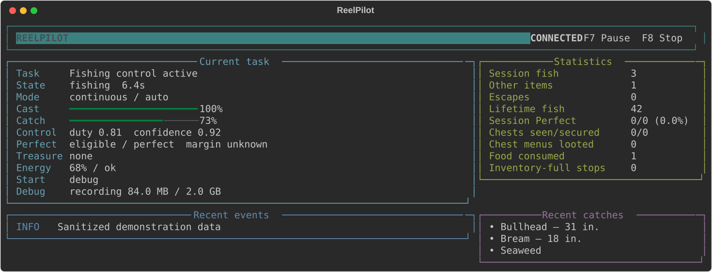
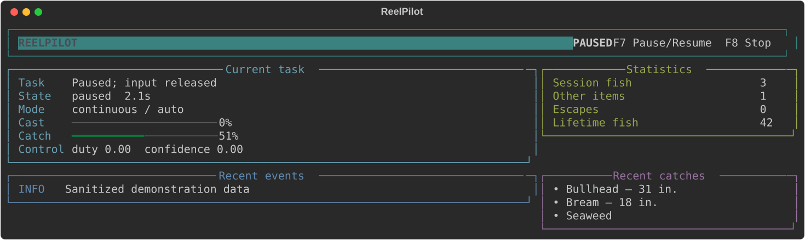
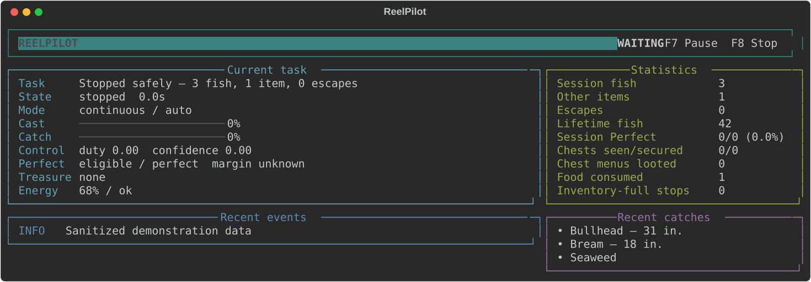

# ReelPilot

[](https://github.com/Captainpax/ReelPilot/actions/workflows/ci.yml)
[](LICENSE)
[](#requirements)

ReelPilot is a safe, observable fishing assistant for Stardew Valley. It casts, detects
bites, controls the fishing minigame, recognizes catch cards, and keeps local session and
lifetime statistics.

> [!IMPORTANT]
> ReelPilot is an unofficial fan project. It is not affiliated with, endorsed by, or
> supported by ConcernedApe or the Stardew Valley publishers. You must own and install
> Stardew Valley yourself.



## Highlights

- Continuous full-charge casting, automatic bite hooking, and minigame control.
- Template-free OpenCV detection: no game sprites, fonts, or art are distributed.
- Predictive normal/darting controller with reachable-center targeting.
- A fail-safe Rust input helper with a 20 ms control cadence.
- Global **F7** pause/resume and **F8** emergency stop.
- A responsive Rich terminal dashboard plus a plain-log mode.
- SQLite-backed catch history with CSV and JSON shutdown exports.
- Optional lossless session recording and deterministic offline replay.

## Requirements

- Windows 10 or Windows 11, 64-bit.
- Stardew Valley 1.6.15 using English text.
- Windowed mode at the minimum window size.
- Game zoom and UI scale set to 75%.
- A fishing rod selected, the character facing valid water, and free inventory space.

Movement, treasure targeting, inventory management, bait replacement, and legendary-fish
optimization are not included.

## Download and run

1. Download `ReelPilot-v0.1.0-beta.1-windows-x64.zip` from
   [Releases](https://github.com/Captainpax/ReelPilot/releases).
2. Extract the entire ZIP. Do not move only the launcher out of its folder.
3. Start Stardew Valley and configure the supported display settings.
4. Select your rod and face the water.
5. Double-click `ReelPilot.exe`.

The launcher opens a dedicated PowerShell window. ReelPilot checks for an already-open
minigame before beginning its three-second casting countdown.

Windows may warn about the unsigned beta executable. Verify the ZIP against
`SHA256SUMS.txt` from the same release. ReelPilot does not require administrator rights.

## Controls and dashboard

- **F7** — pause or resume globally, even while Stardew has focus.
- **F8** — immediately release input and stop.
- **Ctrl+C** — terminal fallback stop.

Pausing always sends mouse-up. On resume, ReelPilot inspects the screen before deciding
whether to recover a minigame, read a result, wait for a bite, or start another cast.



The dashboard reports the current state, cast charge, bite timer, catch progress,
controller output, detector confidence, session results, lifetime totals, recent catches,
and deduplicated events. It refreshes independently at 5 Hz and never renders from the
20 ms control loop.

## Command line

The packaged console executable and source installation support the same interface:

```powershell
reelpilot [options]
python -m reelpilot [options]
```

| Option | Purpose |
| --- | --- |
| `--fishing-level 0..10` | Force `72 + 6 × level` pixels instead of automatic calibration. |
| `--manual-cast` | You cast; ReelPilot detects bites and controls the minigame. |
| `--no-auto-hook` | Control only an already-open fishing minigame. |
| `--cast-hold-seconds N` | Timed fallback from 0.1–2.0 seconds when visual MAX cannot lock. |
| `--controller-profile auto\|normal\|darting` | Select adaptive or forced controller tuning. |
| `--record-session PATH` | Save telemetry and lossless diagnostic crops. |
| `--replay-session PATH` | Replay a recording without locating Stardew or sending input. |
| `--no-stats` | Disable statistics and catch-card files. |
| `--stats-dir PATH` | Override the statistics directory. |
| `--plain` | Use deduplicated scrolling logs instead of the live dashboard. |
| `--version` | Print the ReelPilot version. |

Examples:

```powershell
# Continuous mode with automatic calibration
reelpilot

# Manual casting with forced fishing level
reelpilot --manual-cast --fishing-level 8

# Record a tuning session
reelpilot --record-session .\recordings

# Offline replay; never sends game input
reelpilot --replay-session .\recordings\20260822-120000
```

## Statistics, recordings, and privacy

By default ReelPilot stores data only on this computer:

```text
%LOCALAPPDATA%\ReelPilot\
├── logs\reelpilot.log
└── stats\
    ├── reelpilot.db
    ├── catches.csv
    ├── summary.json
    └── unknown\
```

SQLite is the canonical store for sessions, encounters, catches, records, and performance
totals. CSV and JSON files are compatibility exports written during safe shutdown.
Uncertain catch cards are kept losslessly under `unknown`; ReelPilot records `unknown`
rather than inventing a fish name.

Session recording is opt-in. It writes JSONL telemetry and state-specific PNG crops below
the requested path. These files can contain pixels from your game and should be reviewed
before sharing. ReelPilot has no telemetry service, account, network API, or cloud upload.



## Troubleshooting

### Stardew Valley window not found

Start the game first, select windowed mode, and confirm its title starts with
`Stardew Valley`. ReelPilot will not start its input helper until the game is detected.

### Casting uses the timed fallback

Close menus and overlays and confirm 75% game/UI scale. The fallback duration can be tuned
with `--cast-hold-seconds`; it is used only when the visual meter never confirms.

### Fish coordinates are unreliable

Confirm minimum window size and 75% scale. Record a short session and replay it. Do not
publish the captured PNGs without reviewing them.

### Catch names are unknown

Install the Windows English OCR language capability. ReelPilot deliberately rejects weak
or ambiguous OCR matches.

### Input appears held

Press F8. Both the Python controller and Rust helper send mouse-up during cleanup. If the
process was force-killed, click once manually and inspect `%LOCALAPPDATA%\ReelPilot\logs`.

## Development

```powershell
git clone https://github.com/Captainpax/ReelPilot.git
cd ReelPilot
py -3.14 -m venv .venv
.\.venv\Scripts\Activate.ps1
python -m pip install -e ".[dev]"

python -m pytest -q
python -m ruff check src tests
python -m mypy src\reelpilot

cd native\reelpilot-input
cargo test
cargo clippy -- -D warnings
```

Build the distributable from the repository root:

```powershell
.\scripts\build.ps1
```

The architecture keeps screen capture and OpenCV inside `vision`, deterministic math in
`control`, state transitions in `automation`, Windows input in `input`/`platform`, durable
history in `stats`, and presentation in `ui`.

## Safety, provenance, and contributing

- [PROVENANCE.md](PROVENANCE.md) documents the clean-room-style boundaries and excluded
  upstream material.
- [SECURITY.md](SECURITY.md) explains how to report input-safety issues.
- [CONTRIBUTING.md](CONTRIBUTING.md) covers tests, private fixtures, and coding standards.

ReelPilot is licensed under the [MIT License](LICENSE).
