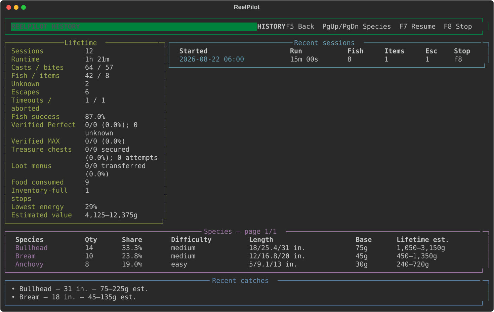

# ReelPilot

[](https://github.com/Captainpax/ReelPilot/actions/workflows/ci.yml)
[](LICENSE)
[](#requirements)

ReelPilot is a safe, observable fishing-assistant project for Stardew Valley. It casts,
detects bites, controls the fishing minigame, recognizes catch cards, and keeps local
session and lifetime statistics.

ReelPilot was created with **educational intent**: it is a practical way to learn Python,
Rust, screen vision with OpenCV, deterministic control, Windows automation, SQLite,
concurrency, packaging, and test-driven QA. It is not intended as a competitive cheating
tool, an anti-cheat bypass, or a way to gain an advantage over other players. Use it only
with your own copy of Stardew Valley, preferably in a private single-player save, and keep
it out of competitive challenges and leaderboards. Gameplay automation still changes the
intended play experience, so each player is responsible for using it appropriately.

> [!IMPORTANT]
> ReelPilot is an unofficial fan project. It is not affiliated with, endorsed by, or
> supported by ConcernedApe or the Stardew Valley publishers. You must own and install
> Stardew Valley yourself.


## Quick navigation

- [Download the latest Windows prerelease](https://github.com/Captainpax/ReelPilot/releases)
- [Install and launch ReelPilot](#download-and-run)
- [Hotkeys and dashboard](#controls-and-dashboard)
- [Command-line options](#command-line)
- [Statistics, recordings, and local data](#statistics-recordings-and-privacy)
- [Source-code map](#source-code-map)
- [Documentation index](docs/README.md)
- [Architecture guide](docs/ARCHITECTURE.md)
- [Statistics guide](docs/STATISTICS.md)
- [Sanitized QA report](docs/QA_REPORT.md)
- [Native Rust helper](native/reelpilot-input/README.md)
- [Provenance boundaries](PROVENANCE.md)
- [Contributing](CONTRIBUTING.md) and [security reporting](SECURITY.md)

## Highlights

- Perfect-first minigame control, verified MAX casting, and low-latency bite hooking.
- Fish-first treasure targeting with automatic post-catch loot transfer.
- Safe automatic refueling below 33% energy from one explicitly reserved food slot.
- Template-free OpenCV detection: no game sprites, fonts, or art are distributed.
- Predictive normal/darting controller with reachable-center targeting.
- A fail-safe Rust input helper with a 20 ms control cadence.
- Safe idle startup with **F7** normal start, **F6** debug start, **F5** history, and **F8** emergency stop.
- A responsive Rich terminal dashboard plus a plain-log mode.
- SQLite-backed catch history with CSV and JSON shutdown exports.
- Optional lossless session recording and deterministic offline replay.

## Requirements

- Windows 10 or Windows 11, 64-bit.
- Stardew Valley 1.6.15 using English text.
- Windowed mode at the minimum window size.
- Game zoom and UI scale set to 75%.
- A fishing rod in hotbar slot 1, positive-energy food in slot 2, the character facing
  valid water, and free inventory space. Both slots are configurable.

Movement, general inventory management, food selection, bait replacement, and
legendary-fish optimization are not included. ReelPilot protects the catch first, then
transfers opened loot when inventory space is available. Auto-eat trusts that the reserved
food slot contains only positive-energy food the user is willing to consume.

## Download and run

1. Download `ReelPilot-v0.1.0-beta.2-windows-x64.zip` from
   [Releases](https://github.com/Captainpax/ReelPilot/releases).
2. Extract the entire ZIP. Do not move only the launcher out of its folder.
3. Start Stardew Valley and configure the supported display settings.
4. Put the rod in slot 1, positive-energy food in slot 2, and face the water.
5. Double-click `ReelPilot.exe`.

The launcher opens a dedicated PowerShell window. ReelPilot waits for Stardew and then
remains safely idle. It does not launch its input helper, cast, click, or consume an
automation timeout until you press F7 or F6.

Windows may warn about the unsigned beta executable. Verify the ZIP against
`SHA256SUMS.txt` from the same release. ReelPilot does not require administrator rights.

## Controls and dashboard

- **F5** — refresh and show historical statistics from READY or PAUSED; press again to return.
- **F7** — start normally from the ready screen; afterward pause or resume globally.
- **F6** — start in debug mode with detailed telemetry and lossless diagnostic crops.
- **F8** — immediately release input and stop.
- **Ctrl+C** — terminal fallback stop.

Use **Page Up** and **Page Down** to navigate species while history is open. F5 is ignored
during active automation; pause with F7 first so database work never competes with fishing.

F6 is accepted only from the ready screen; it does not change modes midway through a
session. Pausing always sends mouse-up. On resume, ReelPilot inspects the screen before deciding
whether to recover a minigame, read a result, wait for a bite, or start another cast.


The current dashboard reports state, cast charge, bite timer, catch progress, treasure
state, energy/refueling status, food consumed, live
containment margin, Perfect eligibility/control phase, controller output, detector
confidence, session results, lifetime Perfect rate, recent catches,
and deduplicated events. It refreshes independently at 5 Hz and never renders from the
20 ms control loop. The F5 view adds all-time sessions, runtime, casts, bites, outcomes,
success, recent sessions, observed species shares, difficulty, length records, and
estimated value ranges.



## Command line

The packaged console executable and source installation support the same interface:

```powershell
reelpilot [options]
python -m reelpilot [options]
```

| Option | Purpose |
| --- | --- |
| `--fishing-level 0..10` | Force `72 + 6 × level` pixels instead of automatic calibration. |
| `--manual-cast` | You cast; ReelPilot detects bites and controls the minigame. |
| `--no-auto-hook` | Control only an already-open fishing minigame. |
| `--cast-hold-seconds N` | Fixed fallback from 0.1–2.0 seconds when visual MAX cannot lock. |
| `--controller-profile auto\|normal\|darting` | Select adaptive or forced controller tuning. |
| `--record-session PATH` | Save telemetry and lossless diagnostic crops. |
| `--replay-session PATH` | Replay a recording without locating Stardew or sending input. |
| `--no-stats` | Disable statistics and catch-card files. |
| `--stats-dir PATH` | Override the statistics directory. |
| `--rod-slot 1..12` | Reserve the rod slot; default 1. Slots 10–12 use `0`, `-`, and `=`. |
| `--food-slot 1..12` | Reserve the positive-energy food slot; default 2. |
| `--no-auto-eat` | Disable the safe-boundary energy check and automatic refueling. |
| `--plain` | Use deduplicated scrolling logs instead of the live dashboard. |
| `--version` | Print the ReelPilot version. |

Examples:

```powershell
# Continuous mode with automatic calibration (then press F7)
reelpilot

# Manual casting with forced fishing level
reelpilot --manual-cast --fishing-level 8

# Use rod slot 3 and food slot 4
reelpilot --rod-slot 3 --food-slot 4

# Choose a custom recording root, then press F7 or F6
reelpilot --record-session .\recordings

# Offline replay; never sends game input
reelpilot --replay-session .\recordings\20260822-120000
```

## Statistics, recordings, and privacy

By default ReelPilot stores data only on this computer:

```text
%LOCALAPPDATA%\ReelPilot\
├── logs\reelpilot.log
├── recordings\
└── stats\
    ├── reelpilot.db
    ├── catches.csv
    ├── summary.json
    └── unknown\
```

SQLite is the canonical store for sessions, encounters, catches, the versioned factual
catalog, records, and performance totals. F5 crosses an ordered writer barrier before it
queries, so newly queued catches appear in the refreshed view. CSV and JSON files are
compatibility exports written during safe shutdown.
Treasure counters distinguish chests seen, targeting attempts, chests secured during the
minigame, and post-catch menus fully transferred. ReelPilot targets a separated chest only
with a large catch-progress reserve and abandons it immediately when preserving the fish
requires recovery. If inventory is full, it stops without dismissing the treasure menu so
items are not knowingly discarded. Every result is checked for an item-grab menu, even
when chest recognition was uncertain.

Energy is read only between encounters. Two of three reliable readings below 33% trigger
refueling. ReelPilot selects the reserved food slot, accepts only an OCR-confirmed eating
prompt, verifies a real energy increase, and repeats until at least 75% energy. It consumes
at most four items over 15 seconds and always reselects the rod before continuing. Missing,
non-food, or harmful items stop safely instead of causing blind confirmation clicks.
Uncertain catch cards are kept losslessly under `unknown`; ReelPilot records `unknown`
rather than inventing a fish name.

Observed rarity means a species' share of your recognized fish catches. The displayed
difficulty tier describes minigame motion, not a universal spawn chance. Sell values are
shown as a normal-quality base and a possible iridium-plus-Angler maximum because the
result card does not expose quality or professions. See
[Statistics and estimated values](docs/STATISTICS.md) for formulas and exclusions.

Session recording is opt-in through F6 or `--record-session`. F6 writes versioned JSONL
telemetry, a diagnostic `report.json`, and lossless state-specific PNG crops beneath the
local recordings directory. Optional images stop at 2 GB per debug session while core
telemetry continues. These files can contain pixels from your game and should be reviewed
before sharing. ReelPilot has no telemetry service, account, network API, or cloud upload.


## Troubleshooting

### Stardew Valley window not found

Select windowed mode and confirm the title starts with `Stardew Valley`. ReelPilot can be
opened first and will wait for the game. After it reports READY, press F7 or F6. The input
helper is not launched merely because the game was detected.

### Casting uses the timed fallback

Close menus and overlays and confirm 75% game/UI scale. The fallback duration can be tuned
with `--cast-hold-seconds`; it is used only when the visual meter never confirms. Without
an explicit override, ReelPilot starts at 1.10 seconds and learns the median duration of
the last five OCR-verified MAX casts, clamped to 0.95–1.25 seconds.

### A catch is not marked Perfect

Only Stardew's visible `Perfect!` indicator produces a confirmed Perfect statistic.
Reliable edge tracking can mark an encounter eligible or missed; uncertain edge frames
remain `unknown`. After the first containment break ReelPilot immediately switches to its
proven recovery controller so preserving the catch takes priority over a bonus that is
already unavailable.

### Fish coordinates are unreliable

Confirm minimum window size and 75% scale. Record a short session and replay it. Do not
publish the captured PNGs without reviewing them.

### Catch names are unknown

Install the Windows English OCR language capability. ReelPilot deliberately rejects weak
or ambiguous OCR matches.

### Refueling stops with `food-unavailable` or `energy-unreadable`

Confirm that the configured food slot contains positive-energy food, the rod and food use
different slots, and Windows English OCR is installed. Keep the right-side energy meter and
eating dialog unobscured. ReelPilot stops rather than guessing when it cannot locate the
meter or the dialog's visible **Yes** button.

### Fishing stops with an item menu open

The backpack could not accept at least one stack. ReelPilot deliberately leaves the menu
open so you can choose what to discard or rearrange. Free inventory space, close the menu
yourself, and restart the automation.

### Input appears held

Press F8. Both the Python controller and Rust helper send mouse-up during cleanup. If the
process was force-killed, click once manually and inspect `%LOCALAPPDATA%\ReelPilot\logs`.

## Source-code map

Use this table as the starting point for exploring the implementation. Each link points to
the code that owns that responsibility rather than asking readers to infer behavior from
the repository layout.

| Area | Start here | Responsibility |
| --- | --- | --- |
| Application | [`app.py`](src/reelpilot/app.py), [`cli.py`](src/reelpilot/cli.py) | Process lifetime, startup hotkeys, settings, and dependency wiring |
| Domain model | [`domain.py`](src/reelpilot/domain.py) | Immutable observations, decisions, states, settings, and records |
| Automation | [`engine.py`](src/reelpilot/automation/engine.py), [`calibration.py`](src/reelpilot/automation/calibration.py) | Cast/bite/minigame/result/refueling state machine and bar calibration |
| Vision pipeline | [`pipeline.py`](src/reelpilot/vision/pipeline.py), [`capture.py`](src/reelpilot/vision/capture.py) | Persistent screen capture, ROI selection, and detector coordination |
| Cast and bite vision | [`cast_meter.py`](src/reelpilot/vision/cast_meter.py), [`bite.py`](src/reelpilot/vision/bite.py) | Visual MAX tracking and spatially confirmed bite recognition |
| Minigame vision | [`fishing_ui.py`](src/reelpilot/vision/fishing_ui.py), [`treasure.py`](src/reelpilot/vision/treasure.py) | Fish, green bar, progress, chest, and loot-menu observations |
| Results and energy | [`catch_card.py`](src/reelpilot/vision/catch_card.py), [`energy.py`](src/reelpilot/vision/energy.py) | Conservative OCR-backed results and template-free energy readings |
| Control | [`controller.py`](src/reelpilot/control/controller.py), [`motion.py`](src/reelpilot/control/motion.py) | Motion estimation, feasible centering, Perfect protection, and recovery duty |
| Windows input | [`input/controller.py`](src/reelpilot/input/controller.py), [`platform/windows.py`](src/reelpilot/platform/windows.py) | Typed Python client, hotkeys, focus, guarded clicks, and cleanup |
| Rust helper | [`main.rs`](native/reelpilot-input/src/main.rs), [helper README](native/reelpilot-input/README.md) | Versioned protocol and deadline-based, fail-safe mouse pulsing |
| Statistics | [`repository.py`](src/reelpilot/stats/repository.py), [`service.py`](src/reelpilot/stats/service.py), [`catalog.py`](src/reelpilot/stats/catalog.py) | SQLite migrations/writes, historical aggregation, and factual catalog metadata |
| Recording | [`recorder.py`](src/reelpilot/recording/recorder.py), [`replay.py`](src/reelpilot/recording/replay.py) | Bounded telemetry/image recording and input-free deterministic replay |
| Dashboard | [`dashboard.py`](src/reelpilot/ui/dashboard.py), [`logging.py`](src/reelpilot/ui/logging.py) | Rich snapshots, history pages, summaries, and deduplicated logs |
| Tests | [`tests/`](tests/), [`QA_REPORT.md`](docs/QA_REPORT.md) | Synthetic behavior checks, safety invariants, package checks, and sanitized live evidence |

The [documentation index](docs/README.md) provides learning paths for readers interested in
screen vision, real-time control, safe automation, or data storage.

## Developer setup

```powershell
git clone https://github.com/Captainpax/ReelPilot.git
cd ReelPilot
py -3.14 -m venv .venv
.\.venv\Scripts\Activate.ps1
python -m pip install -e ".[dev]"

python -m pytest -q
python -m ruff check src tests
python -m mypy src\reelpilot

cd native\reelpilot-input
cargo test
cargo clippy -- -D warnings
```

Build the distributable from the repository root:

```powershell
.\scripts\build.ps1
```

The [architecture guide](docs/ARCHITECTURE.md) explains why screen capture and OpenCV stay
inside [`vision`](src/reelpilot/vision/), deterministic math in
[`control`](src/reelpilot/control/), state transitions in
[`automation`](src/reelpilot/automation/), Windows APIs in
[`input`](src/reelpilot/input/) and [`platform`](src/reelpilot/platform/), durable history
in [`stats`](src/reelpilot/stats/), and presentation in [`ui`](src/reelpilot/ui/). See the
[statistics guide](docs/STATISTICS.md) for schema and estimate details and the
[sanitized QA report](docs/QA_REPORT.md) for the latest automated and live evidence.

## Safety, provenance, and contributing

- [PROVENANCE.md](PROVENANCE.md) documents the clean-room-style boundaries and excluded
  upstream material.
- [SECURITY.md](SECURITY.md) explains how to report input-safety issues.
- [CONTRIBUTING.md](CONTRIBUTING.md) covers tests, private fixtures, and coding standards.

ReelPilot is licensed under the [MIT License](LICENSE).
